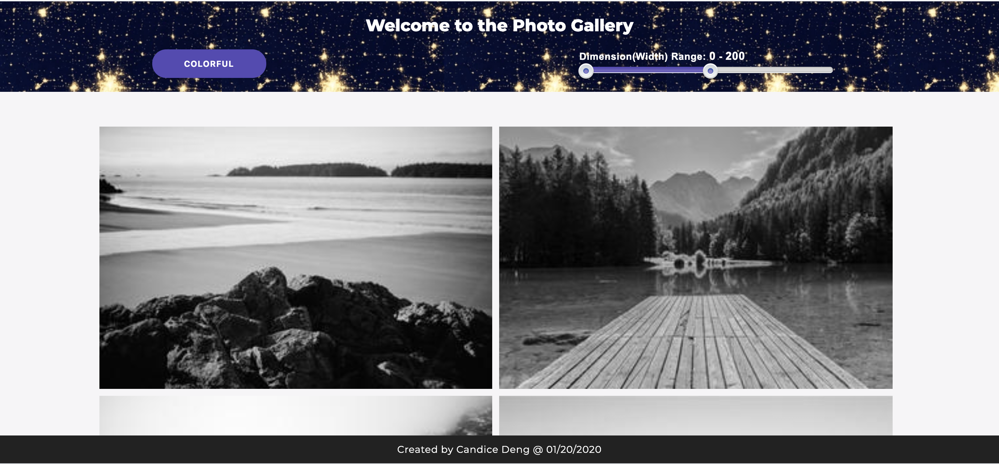
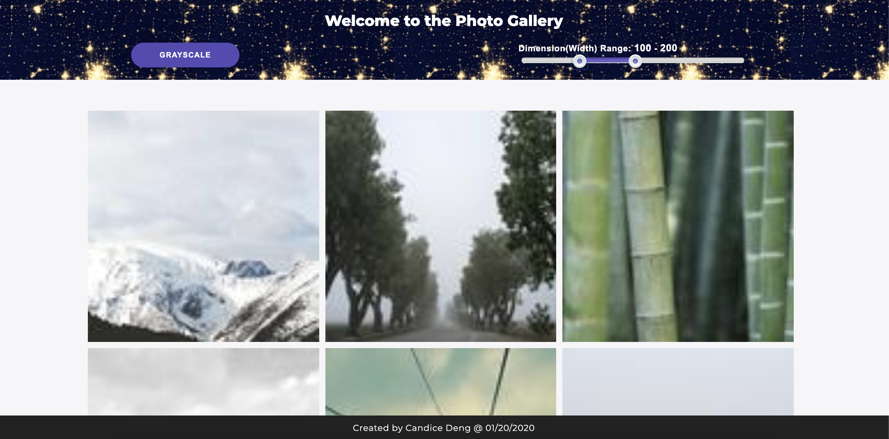

# Photo Gallery Application

## About

This application allows users to register in and get access to the photo gallery, as well as to grayscale and filter images by its dimension (width to be more specific). It can be visited through <strong>"http://8992fadc.ngrok.io/register"</strong> directly without the need of installing any package. <br/>

```diff
-Please let me know via candicedeng86@gmail.com if the link becomes invalid, thank you.
```
## Basic Functions
### Registration 
1. By clicking "Sign In"/"Sign Up" button, users could switch between the login and register form.<br/> 
```diff
-Existing problem: The application does not support existing user to log in at current stage. Sorry for the incovenience.
```


2. After entering all required information to the "Create Account" form, the user will be directed to the gallery page.


### Image Manipulation
1. Clicking the "GrayScale" button would change all current listed images into grayscale, while clicking the same button when it shows "Colorful" would turn images to their original status.


2. By moving the double-sided slider users could filter all images according to their dimension, only images with the right width would show on the page.


### If run locally
If you prefer to run it locally, please download this file and change directory to it by command “cd photoGalleryApplication” in your terminal first, and follow the steps below.

-	Type “mysql -u root -p” in the terminal, enter your password to log in MySQL, if there is “command not found” error, try run “export PATH=${PATH}:/usr/local/mysql/bin” first.
-	After logging in, try command “show databases;” to check if database “photoGallery” exists, if not, type command “create database photoGallery;” to create database
-	By using “use database photoGallery;” to enter the database and try command “show tables” to check whether table “users” exists, if not, create the table by command “create table users(username varchar(255) NOT NULL, email varchar(255) NOT NULL, password varchar(255) NOT NULL, created_at TIMESTAMP NOT NULL, updated_at TIMESTAMP NOT NULL DEFAULT NOW() ON UPDATE NOW());”
-	Now backend database is properly set, entering all required information on the registration form would lead users to the photo gallery page.
